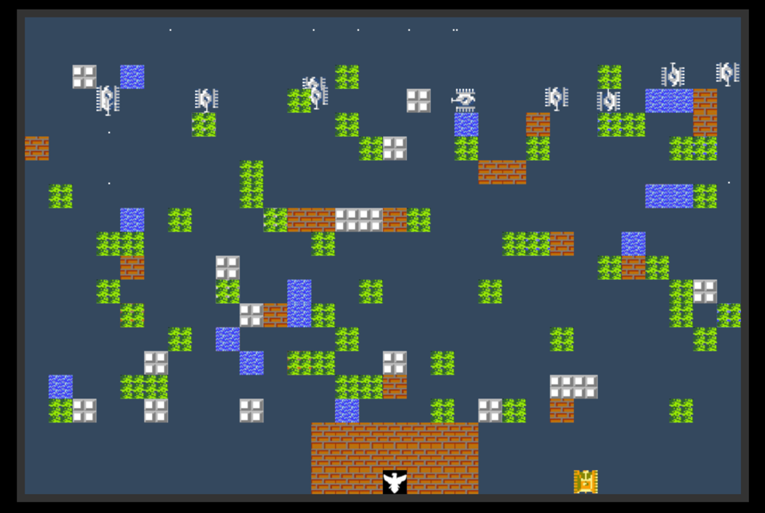
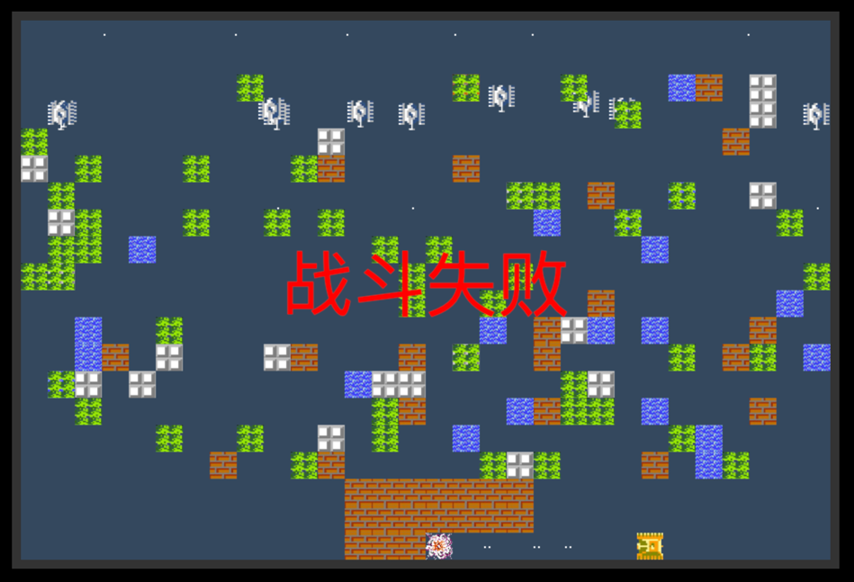

# 坦克大战

## 👏🏻 欢迎大家收藏这个项目

## 😄 技术栈

TS+Canvas+Vite+Scss 完成的一个面向对象写法的坦克大战，可以提高你自己的ts使用以及面向对象的理解。

- ts类型支持
- ts中抽象类
- 面向对象oop写法

## 安装

克隆项目

````bash
$ git clone https://gitee.com/Chihiro1221/tank.git
# or
$ git clone https://github.com/Chihiro1221/tank.git
````

安装依赖

````bash
$ yarn
# or
$ npm i
````

## 使用

````bash
# 本地运行
$ yarn dev
# 打包
$ yarn buil
# 预览
$ yarn preview
````

## 操作

`↑ ↓ ← →`操作坦克移动

`space` 发射子弹

## 项目结构

````
canvas -> 画布
  - canvas.ts -> 画布抽象类
enum -> 枚举
model -> 模型
  - model.ts -> 模型抽象类
service -> 服务
static -> 静态资源
app -> 启动文件
main -> 入口文件
style.scss -> 样式文件
vite-env.d.ts -> 类型声名文件
config.ts -> 配置文件（重要）
````

## 后端运行

项目中的`server`目录，是使用`express`挂载的打包之后的坦克大战静态资源

### 使用

````
$ cd server
$ yarn
$ nodemon main.js
...
````

## 项目截图





在线预览地址：[tank.langya11.icu](tank.langya11.icu)
